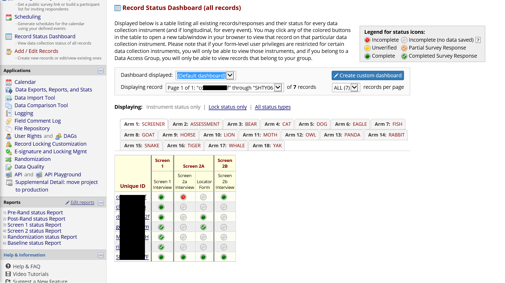
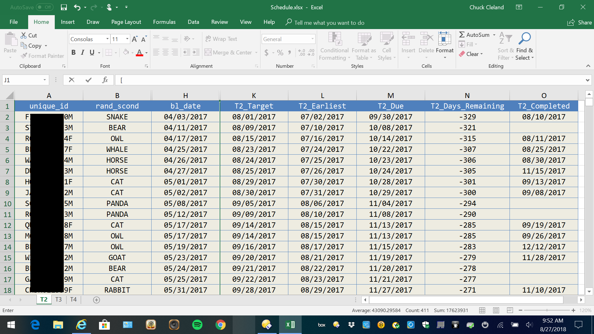
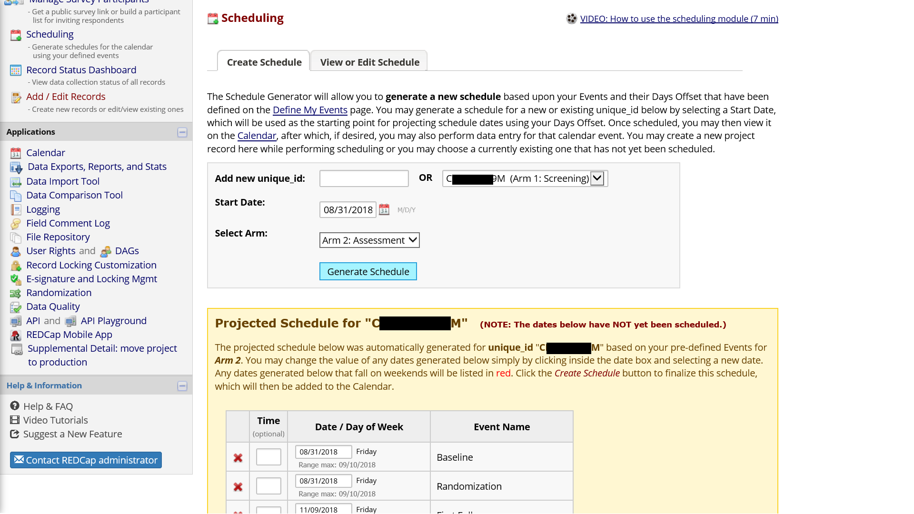

```{r setup, include=FALSE}
knitr::opts_chunk$set(echo=TRUE, comment=NA, message=FALSE, warning=FALSE, fig.align = 'center', fig.width = 12, fig.height = 10)
options(width=110)
```

# Overview of the Manual

The goal of this manual is to show how one might setup a [REDCap](https://projectredcap.org) project to support a research study with multiple conditions, such as factorial experiments common in the Multiphase Optimization Strategy ([MOST](https://methodology.psu.edu/ra/most)) framework. This manual is not meant to replace extensive and excellent documentation of REDCap. We will point to specific [REDCap documentation](https://projectredcap.org/resources/videos/) where readers can find more details when appropriate.

The manual is organized into three parts: 1) identification of common MOST study elements which need to be implemented in REDCap; 2) an overview of the REDCap system; and 3) an example REDCap project to illustrate how one might use REDCap to manage research conducted in the MOST framework.  The example project is intentionally small, to focus on overall organization, but the ideas in the example can easily be extended to more study conditions, events, and data collection fields. 

# MOST Study Elements

It is helpful to start by thinking of different elements likely to be needed for MOST and other research studies. Major elements to consider include the following: 

1. unique identifiers for individual participants
2. assessments
3. participant locator information
4. randomization
5. intervention component activities

## Unique identifiers

MOST studies will typically have a longitudinal component with individual participants returning, in person and/or online, for multiple activities. Consideration should be given to how individuals will be recognized over time.  

### Possible elements of a unique identifier:

1. First two letters of individual's LAST name
2. First letter of individual's FIRST name
3. First letter of mother's FIRST name
4. Month of birth, two digits
5. Day of birth, two digits
6. Last two digits of year of birth
7. Gender at birth (M or F)

An example: **CLCJ060769M**

Projects can create a process for collecting the unique identifier that includes a check on the length (exact number of characters) and, if this is the participant's very first study visit, a check that the unique identifier does not already exist in the project.

The unique identifier will be used to recognize an individual participant over time and keep all data related to that participant together through data management steps, so it is critical that it be collected and entered accurately whenever it is needed.  Project staff should be trained on the process for collecting and working with the unique identifier, and it may be useful to inform participants that the elements of the identifier need to be reported consistently over time. 

## Assessments

MOST studies will typically have at least four kinds of assessments of individual participants:

1. screening for eligibility
2. locator information to facilitate contact with individuals over time
3. baseline interview
4. one or more follow-up interviews

It is important to keep in mind that some individuals who are screened will not be eligible, and therefore will not continue into the main study. There also may be a lag of uncertain length between the start of screening for a potential participant and enrollment of that participant if eligible.  For REDCap setup, the implication is that screening should be a separate piece of the study.  This allows the timing of follow-up interviews and intervention activities to depend on the date of enrollment/baseline rather than the date on which screening started.

## Locator information with ongoing updates

A number of REDCap fields will be devoted to information to facilitate contacting individual participants over time for study activities. These may include:

1. cell phone number
2. email address
3. mailing address
4. names and contact information for family members, friends, or service programs likely to know where/how to find an individual participant

These fields may be entered and updated by project staff rather than participants directly. REDCap allows different users (i.e., staff on the project) to have or not have the rights to do different things within the system, and locator may be one part of the project where access is limited to specific staff.

Locator information can be updated when an individual participant is present for an assessment or intervention activity, so think about how updates to locator fields will be integrated into a regular project workflow.

## Intervention component activities

Think of fields needed within REDCap to document aspects of intervention component delivery. Components may be sessions with individual participants, group activities, or technology (e.g., text messages). At a minimum, the date, staff, duration, and completion status of an activity should be captured. Other fields related to intervention activities may include ratings of fidelity, measures of engagement/satisfaction, and descriptions of content discussed.   

## Condition-specific activities and data collection

The typical MOST study will have at least four different conditions and may have many more conditions. Some study activities and data collection will be condition-specific (only relevant for some of the study conditions). As will be described below, REDCap has a way to define events and related data collection that are specific to subsets of study participants.  

## Need to monitor and drive completion of common and condition-specific study activities

REDCap divides the whole study into **arms**, which are groups of events which may be common to all participants or specific to a subset of participants.  

To be more concrete, a participant in a condition which is assigned to the active level of a component gets events specific to that component (e.g., an intervention session).  Other events, such as a baseline interview, will be common to many more participants.  Some events may be univeral, such as a screening interview to determine eligibility for the study.  Event scheduling and data collection within the REDCap system is on an as needed basis.   

## Keeping track of intervention components and study conditions

As you prepare to set up REDCap to manage a study, it can be useful to create a table showing the study conditions and which level of each component they receive. Giving the study conditions names, rather than referring to them only with numbers or letters, can make it easier for staff to think about and discuss activities needed for specific conditions. Consider a 2 x 2 x 2 full factorial design. A table to guide REDCap setup may look something like this:

| Condition | Name    | Video       | Text Messages | Support Groups |
|:---------:|:-------:|:-----------:|:-------------:|:--------------:|
| 1         | tuna    | 20 minutes  | Yes           |  Yes           |
| 2         | salmon  | 20 minutes  | Yes           |  No            |
| 3         | marlin  | 20 minutes  | No            |  Yes           |
| 4         | bass    | 20 minutes  | No            |  No            |  
| 5         | trout   | 3 minutes   | Yes           |  Yes           |  
| 6         | shark   | 3 minutes   | Yes           |  No            |  
| 7         | carp    | 3 minutes   | No            |  Yes           |  
| 8         | halibut | 3 minutes   | No            |  No            |  

In this example, study conditions are given fish names. With more than 16 conditions, names may not be helpful/feasible.  Each study condition will have a unique set of planned activities, which REDCap calls **events**.  Part of setting up a REDCap project for the study will involve mapping out all of the events each condition will experience, and at each of these events, one or more instruments may be designated for data collection.  

# Overview of REDCap 

Before you begin the setup of a MOST study, familiarize yourself with the REDCap system. Good starting points are the [brief](https://flash.its.vanderbilt.edu/html5/redcap/streams/_definst_/redcap_overview_brief02.mp4) and [detailed](https://flash.its.vanderbilt.edu/html5/redcap/streams/_definst_/redcap_overview03.mp4) overview videos.


## Types of REDCap Projects

  REDCap offers a variety of project types.
  


If your interest is using REDCap to manage the complex set of activities in a typical MOST study (multiple conditions, condition-specific and common activities), you almost certainly want the **Longitudinal+Scheduling (multi-use data entry forms, defined time points)** project type. 

## Ways to Build a REDCap Project

In addition to the various **whole project settings** within REDCap, there are two ways to build the data collection fields of a REDCap project: the online designer and the data dictionary.

### Online Designer
  
The [online designer](https://web.vanderbilt.edu/clients/video-player/player.php?dir=redcap&file=online_designer01.mp4) is an intuitive, point-and-click interface which allows users to build data collection fields.  Online designer also allows users to select instruments from the REDCap Shared Library, a repository of instruments which can be selected and inserted into your own project.  If an instrument the project needs exists within the library, this can save time and reduce errors.
  

  
This is what the interface to add a new field within online designer looks like:
  


### Data Dictionary
  
The [data dictionary](https://web.vanderbilt.edu/clients/video-player/player.php?dir=redcap&file=redcap_data_dictionary02.mp4) is a comma-delimited file with a very specific structure that can be used to specify fields in REDCap. An advantage of working directly in the data dictionary is that similar items can be setup more quickly by copying and pasting aspects of fields that are shared across the items.  Many of the cells in the data dictionary may be blank/unused.
  

  
Here is a brief description of the content specified in each of the **18** columns of the data dictionary:
  
| Column                                         | Description                                                                                    |
|:-----------------------------------------------|:-----------------------------------------------------------------------------------------------|
|  1. Variable / Field Name                      | A short name for the field which will become a variable name in exported data                  |
|  2. Form Name	                                 | Identifies a group of fields that go together; for example, locator form groups locator fields |
|  3. Section Header	                           | Provides a way to include headers and instructions between data collection elements            |
|  4. Field Type	                               | Common types include text, descriptive, radio, checkbox, file, and notes                       |
|  5. Field Label	                               | More detailed text associated with the field; for example, the content of an interview item    |
|  6. Choices, Calculations, OR Slider Labels	   | Response options or a calculation based on fields collected earlier                            |
|  7. Field Note	                               | A way to add instructions or other content to the field; for example, "minutes" for a duration |
|  8. Text Validation Type OR Show Slider Number | Specifies the kind/format of data expected; for example, date_mdy for a date field            	|
|  9. Text Validation Min	                       | Minimum allowed value for a field with validation                                              |
| 10. Text Validation Max	                       | Maximum allowed value for a field with validation                                              |
| 11. Identifier?	                               | Flags fields with identifying information (e.g., name) to facilitate de-indentified exports    |
| 12. Branching Logic (Show field only if...)	   | A way to specify who should complete the field, based on data collected in other fields        |
| 13. Required Field?	                           | Does the field have to be completed before continuing?                                         |
| 14. Custom Alignment	                         | A way to control the alignment of the content shown when the field is completed	              |
| 15. Question Number (surveys only)	           | Auto-numbering is available, but custom item numbering for surveys can be specified here     	|
| 16. Matrix Group Name	                         | A way of grouping fields together into a matrix; fields with the same matrix name go together  |
| 17. Matrix Ranking?	                           | Used to rank choices in a matrix group; implies no two fields can have the same value          |
| 18. Field Annotation                           | Not displayed; can be used to set defaults, hide fields, and for other purposes                |
  
Both the online designer and the data dictionary allow customization of formatting, as both understand HTML code.  The example MOST project illustrates some of these possibilities below.

## Interview Items and Other Data Collection Fields
### Item types  

REDCap offers a wide variety of survey and interview [item types](https://web.vanderbilt.edu/clients/video-player/player.php?dir=redcap&file=field_types02.mp4).

* Text box (short text, number, date/time, etc)
* Notes box (paragraph text)
* Calculated field (derived from other fields)
* Multiple choice (drop-down list OR radio buttons)
* Checkboxes (check all that apply)
* Yes/No
* True/False
* Signature (with mouse, finger, or other device)
* Slider/Visual Analog
* File upload
* Descriptive text


### Branching logic

Branching logic is the way REDCap refers to interview skip patterns.  These are employed when fields need to be hidden during certain circumstances.  For instance, you may want to hide the question “How many hours per week do you watch TV?” until a “Yes” answer is checked for the previous question, “Do you watch TV?”.  

### Piping

Piping refers to inserting the response from an earlier data collection element into the content of a later data collection element.  Collected data can be piped not just to the field label of a subsequent field, but to any of the following places:

* Field Label
* Field Note
* Section Header
* Matrix field column headers
* Option labels for multiple choice fields (radio, drop-down, checkbox)
* Slider field labels (i.e. text displayed above slider bar)
* Custom record locking text (if defined, displayed at bottom of form)
* Survey Instructions
* Survey Completion Text
* Survey invitation emails (sent via Participant List or Automated Invitations) - includes both subject and message
* Custom text displayed at top of Survey Queue
* Inside the URL for a survey's 'Redirect to a URL' setting

All you need to do to pipe a data value into any of these valid places is insert into your text the variable name inside square brackets.

### Calculated fields

Calculations should be considered a tool not data.  Calculations should be reapplied during data analysis.  Do not reference calculated fields within calculated fields.  When multiple calculations are performed on the same data entry form, the order of execution is determined by the alphabetical order of the associated field names.

**Problem**:  Here, Calculation 2 will occur before Calculation 1!   
Calculation 1 [weight_met]=[weight]*.45359237    
Calculation 2 [BMI]=[weight_met]/([height]^2)  

To avoid this problem, calculate BMI in one step.

### Data validation  

Data validation provides ways to ensure collected data is entered in an expected format or falls within an expected range.  For example, a field collecting participant age in years could specify that only whole numbers from 0 to 150 are allowed.  When a response outside of the allowed range is given, REDCap will prompt the survey respondent or staff entering data to revise the entry. 

## Forms vs. Surveys for Data Collection

Two ways of collecting/entering data in REDCap are Forms and Surveys.  Forms are for data entered by project staff, not directly by participants.  Forms might be used to enter the results of biological testing or responses to items in a staff-administered personal interview.  Surveys are for data entered directly by participants.  Surveys may take place at a study field site, as an audio computer-assisted self-interview, or participants could be invited by email (or in other ways) to complete a survey in a location of their choice and with some flexibility around exactly when it happens (e.g., a participant could take a survey by following a link on their home computer at 9:45pm on a Sunday).

## Events and Arms

The entry point for setting up events within REDCap is the **Project Setup** tab.  This is where one can define study events and designate instruments used for each event.
  

  
Each **arm** in the project is a collection of events in a sequence.  In a MOST study, each condition may have a unique sequence of study events, and arms in REDCap are a way to specify different events for different participants.  For study conditions which receive multiple components, REDCap setup is an opportunity to consider the order in which those components will be delivered to participants, and whether temporal overlap among components is permissible or not.  REDCap setup is a good time to consider how intervention component activities and assessment activities are temporally organized.  

Think about the timeline of study events for an individual study participant.  All potential participants start with screening events used to determine eligibility.  This is a one of the events which will be common to all participants.  Other events common to all participants may be: 1) a baseline interview; 2) randomization to a condition; and 3) one or more follow-up interviews.  Based on the results of randomization, condition-specific events will come into play.  The typical MOST study will need at least one arm for the common events occurring prior to randomization as well as arms for each unique study condition.  For example, a 2 * 2 * 2 full factorial design with 8 unique conditions would have at least nine arms in REDCap.  If you organize the project for your MOST study in this way, REDCap will warn you that a record (participant) is present in more than one arm of the project.  But it does allow this, and with the same participant in more than one arm you benefit from REDCap handling randomization, study activities before randomization, as well as condition-specific events. 

### Days-offset
Days-offset is part of defining events for an arm.  When the scheduling module is turned on, days-offset specifies the “ideal” time for an activity as well as a range during which the activity can be completed.  Implicitly, days-offset also specifies the order in which events for an arm will take place, as well as the interval of time between events.  **Offset Range** puts a window around the event time, providing flexibility in the exact timing of the event.  Each **arm** has its own definition of events, including days offset.

[Defining Longitudinal Events (5 min)](https://web.vanderbilt.edu/clients/video-player/player.php?dir=redcap&file=define_events02.mp4)

### Designating Instruments for Events
Each event can be connected with one or more data collection instruments to be completed during the event.  This allows the same instrument to be completed on more than one occasion.  Think of a grid with specific data collection instruments as row names and specific events as column names.  The designation of instrument for events entails identifying which instruments should be administered during each event.  As each **arm** has a unique set of events, designation of instruments is done separately for each **arm**.

[Designating Instruments for Events (3 min)](https://web.vanderbilt.edu/clients/video-player/player.php?dir=redcap&file=designate_instruments02.mp4)

### Events and instruments can be repeated in a longitudinal project 

There are at least three ways to repeat collection of the same data fields over time.

One approach is to **embed the same interview item in different instruments** (with different variable names).  This is an attractive approach if you have fairly long baseline and follow-up interviews which need small changes from one time point to another and you do not want to break up the interview into many smaller instruments.  Having the baseline interview as a single instrument will mean less starting and stopping within a long interview session.  Also, if create distinct instruments with overlapping items, you can customize aspects of each interview.  For example, piping can be used to remind the participant of the last interview date.     

A second approach is to **specify every event ahead of time** and repeat one or more instruments across multiple events.  This approach is attractive for elements of study activities that are more structured and planned out ahead of time.  For example, you may have a baseline interview and a small number of follow-up interviews which need to take place within a specific window of time.  An instrument you plan to administer multiple times can be specified once.  The time points at which interviews will be administered are specified as events.  Then instruments are linked to events as described under **Designating Instruments for Events**.  This approach allows you to use REDCap to schedule when each of the planned events will happen for individual participants.

A third approach is to turn on functionality for repeating instruments or, in a longitudinal project, repeating instruments and/or events an **unlimited and unknown number of times**.  The is useful when an event needs to be repeated frequently or an unknown number of times.  One example of where this may be the most efficient approach is asking about contacts in an intensive intervention component.  The number and spacing of contacts will vary across participants and will not be known in advance.  Rather than generating many contact events or fields, a small set of fields related to a contact (date, mode, staff, duration, outcome) can be repeated as often as needed.  

A mix of these approaches can be used for different instruments.  The approach used has implications for how data will be organized when exported (longer vs. wider format).  Be prepared to figure out how the exported data are organized and to do some reshaping of the exported data.

[Repeating Instruments and Events (33 min)](https://web.vanderbilt.edu/clients/video-player/player.php?dir=redcap&file=repeating_forms_events01.mp4)

## Scheduling and Calendar Application
### Scheduling
When a participant experiences the first event in an arm, other events in that arm are scheduled based on defined events and their days-offset.  It is very common to make changes to a participant's default schedule to a time more convenient for the project and participant (e.g., moving an event from a Sunday to a Monday).  Record-specific scheduled events will appear on the project's calendar, along with the record's unique identifier.

[Scheduling Module (7 min)](https://web.vanderbilt.edu/clients/video-player/player.php?dir=redcap&file=scheduling02.mp4)

### Calendar
Calendar can be used to see what record-specific events are scheduled and to enter a data collection form associated with the scheduled event (e.g., if the scheduled event is a baseline interview, following the calendar link will open the baseline interview data collection forms).  The calendar shows the event and the unique identifier, so project staff know which participants need which events on a given day.

[The Calendar (7 min)](https://web.vanderbilt.edu/clients/video-player/player.php?dir=redcap&file=calendar02.mp4)

## Randomization Module
The randomization module sets up REDCap to randomly assign participants to specific study groups.  
Setup includes the following steps:  
1. Define your randomization model  
2. Download template allocation tables (as Excel/CSV files)  
3. Upload your allocation table (CSV file)  

Randomization can be stratified by one or more variables collected before the randomization step.  User rights functionality can control which project staff are allowed to randomize.  After the value of the random group is assigned, the random group field becomes read-only and the value cannot be changed (by design!).

The table of allocations used by REDCap is generated outside of REDCap and saved in comma-delimited format.  The comma-delimited allocation table is uploaded to REDCap as the third and final step in setting up the randomization module.  In the example shown in the figure below, participants are assigned to one of eight study conditions and random assignment is stratified by gender.


Include more assignments than you believe you will need in the table of allocations to allow for participant drop-out and drop-in as well as uncertainty in the proportion of participants enrolled in each strata.  For example, if the study design calls for randomization to eight conditions stratified by gender and forty participants in each condition, you might generate an allocation table with sixty assignments per condition in each strata (i.e., a total of 60 * 8 * 2 = 960).

Here is an example of generating the allocation table for stratified random assignment using R:

```{r}
library(tidyverse)
DF <- expand.grid(Person = 1:800, scr1_gender = 1:2)
DF <- DF %>% mutate(Block = cut(Person, 100))
set.seed(732212)
DF <- DF %>% 
  group_by(scr1_gender, Block) %>% 
  mutate(rand_scond = sample(3:10)) %>% 
  ungroup()
write.table(DF %>% select(rand_scond, scr1_gender), file = "atab.csv", row.names = FALSE, sep = ",")
```

### Randomization Dashboard
When the project is underway, and some participants have been assigned to conditions, the Randomization Module includes a dashboard showing the number of participants (records) assigned to each condition in each strata, which is useful for tracking enrollment progress.


## Reports

Reports can show data fields to understand collected data and facilitate project management.  
There are four steps to building a report:  
1. Select users who can access the report  
2. Select data fields to include in the report  
3. Select cases to include using logic applied to data fields (e.g., only show female participants)  
4. Select data fields used to order the results (e.g., sort report by age)  


## Record Status Dashboard

The Record Status Dashboard allows project staff to see which data entry forms have been completed for different individual participants.



## Data Export

### Pulling REDCap data by API

REDCap project data can be exported using an "Application Programming Interface" (API), which is just a way to request the export within a program rather than manually pointing and clicking.  Thus, API makes the process of regularly exporting data for summaries and project management smoother and more efficient.  Using API for export will most likely require a user- and project-specific *token* which is requested from your institution's REDCap administrator.  The token is a security measure used to authenticate a user's identity and rights to work with the data programmatically for a specific REDCap project.  API is likely something only one or a very limited number of project staff will need and have rights to use.

Here is an example of an R program which exports all data from a REDCap project and saves it in Rdata format:
```{r, eval=FALSE, echo=TRUE}
library(redcapAPI)
library(openxlsx)

tkns <- read.xlsx("tkns.xlsx")

rcon <- redcapConnection(url = 'https://openredcap.nyumc.org/apps/redcap/api/', token=tkns[4,3])

projdata <- exportRecords(rcon, batch.size = 700)

save(list=c('projdata'), file = "projdata.Rdata")
```

The MS-Excel file contains the token needed for authentication.  Reading it from a file this way keeps the token private.  The combination of the institution's REDCap server, the user's identity, and the token uniquely identify the project from which data should be exported.  

For these steps to work, you may need to be behind your institution's firewall, or may need to establish a secure VPN connection with your institution if working remotely.  Contact your institution's REDCap administrator if you have problems getting data export via API to work.

Once the exported data have been saved locally or in a secure shared folder, detailed regular summaries can be run. 

### Data from smaller projects can be exported manually within REDCap too

REDCap can export to the following formats: comma-delimited; SPSS; SAS; R; Stata; and XML.  The export interface can be accessed from the Project Home tab of your REDCap project.


  
## Things more easily done outside of REDCap

It is very likely you will want and need to do things with the collected data that are impossible or difficult to do within the REDCap system. A fairly efficient approach is to regularly export data from REDCap, and then generate the summaries and files needed to facilitate project management. The ability to use an application programming interface (API) to pull data from REDCap in a program greatly improves the efficiency of this workflow. I have used a combination of tools including various [R](https://www.r-project.org) packages and [GitHub](https://github.com/) to support the Heart-to-Heart 2 MOST study. The [redcapAPI R package](https://cran.r-project.org/web/packages/redcapAPI/index.html) uses the REDCap API to pull current project data, then there are many data management, summarizing, and list making steps in [R](https://www.r-project.org), and web pages generated in [R](https://www.r-project.org) are hosted on [GitHub](https://github.com/). GitHub and similar tools have options for both public and private repositories.  In addition to the web pages, it can be useful to generate MS-Excel files which list individual participants and highlight completed and needed study activities.  The [openxlsx R package](https://cran.r-project.org/web/packages/openxlsx/index.html) can be used to write MS-Excel files from R. 

### Review intervention activity gaps

Generating a simple list of participants with intervention activity due and completion dates can be useful for managing and driving completion of intervention activities.  This can be a useful supplement to what can be achieved within REDCap with **Reports** and the **Record Status Dashboard**.


### Review follow-up interviewing gaps

Generating a simple list of participants with interview target, earliest, and due dates, as well as days remaining and interview completion, can be useful for managing and driving completion of interviews.  This can be a useful supplement to what can be achieved within REDCap with **Reports** and the **Record Status Dashboard**.



## REDCap Development and Production Modes  
REDCap has a **development** and a **production** mode. The development mode allows one to incrementally build and test project components.  The production mode is meant for real data collection and project management.  It is possible to make some changes after moving the project from the development to the production mode, but once in production changes should be made with extreme care.  

## REDCap is actively developed
Researchers using REDCap to manage MOST and other types of studies need to be aware of new features and system changes which may impact aspects of your project.  These changes are generally enhancements (new features) which don't have to be adopted in the middle of a project.  New REDCap features may require changes to this manual over time.

# A MOST REDCap project providing an example

The example illustrates the steps to set up a REDCap project for a 2 x 2 x 2 full factorial design.  The intervention components in the example project are: 1) video; 2) support groups; and 3) text messages.  Video has brief and detailed levels while the other two intervention components are either on or off.

| Condition | Name    | Video       | Text Messages | Support Groups |
|:---------:|:-------:|:-----------:|:-------------:|:--------------:|
| 1         | tuna    | 20 minutes  | Yes           |  Yes           |
| 2         | salmon  | 20 minutes  | Yes           |  No            |
| 3         | marlin  | 20 minutes  | No            |  Yes           |
| 4         | bass    | 20 minutes  | No            |  No            |  
| 5         | trout   | 3 minutes   | Yes           |  Yes           |  
| 6         | shark   | 3 minutes   | Yes           |  No            |  
| 7         | carp    | 3 minutes   | No            |  Yes           |  
| 8         | halibut | 3 minutes   | No            |  No            |

Therefore, the example study has **8** conditions.

## Enter the New Projects Tab of REDCap to select a project name and type


## Longitudinal Project Setup Steps

### Main Project Settings

* Enable: **Use surveys in this project**
* Enable: **Use longitudinal data collection with defined events**
* Enable: **Repeatable instruments and events**
* Enable: **Scheduling module**
* Enable: **Randomization module**
* Disable: **Auto-numbering for records**


### Arms

Arms will be created to organize events related to the following study parts:

1. screening for eligibility
2. assessments common to all participants, including locator, a baseline interview, randomization, and two follow-up interviews 
3. condition-specific events which utilize schedules tailored to individual study conditions and collect data related to the intervention activities in each study condition

Create **10** study arms with **Define My Events**.  Specific intervention conditions have been given fish names.

### Instruments
The example project has the following **13** instruments:  
1. Unique Id  
2. Screening  
3. Baseline Interview  
4. Patient Health Questionnaire 9  
5. GAD-7  
6. Brief Video  
7. Detailed Video  
8. Support Groups  
9. Text Messages  
10. Locator  
11. Randomization Form  
12. Core Component Form  
13. Randomization Check Form  

As described above, instruments can be created via **Online Designer** or the **Data Dictionary**.

### Events
The example project has the following **41** events across the **10** arms:
```{r, echo=FALSE}
library(openxlsx)
events <- read.xlsx("MOSTManual_Events_2018-08-31.xlsx")
events %>% select(-custom_event_label) %>% knitr::kable()
```

### Instrument Designations
The example project has the following **93** instrument designations.  These specify which instruments should be completed during each event.   
```{r, echo=FALSE}
library(openxlsx)
events <- read.xlsx("MOSTManual_InstrumentDesignations_2018-08-31.xlsx")
events %>% knitr::kable()
```

## Moving Through Activities for One Participant

With the example project, you can add new records to move through activities for individual participants and plan workflows for your own MOST study.

The only event in the screening arm, a brief eligibility interview, is common to all potential study participants. There could be additional events in the screening arm for things like results of biological tests and documentation of a status related to eligibility criteria.  The goal of the screening arm is to assess various aspects of eligibility criteria, documenting who is eligible and, if not eligible, the reasons why.  Only potential participants who are eligible proceed to the main study.  Informed consent may be obtained from eligible individuals near the end of the screening arm.

After screening may be a good time to generate a schedule for an eligible and enrolled participant.  Schedule generation is arm-specific.  The schedule can be modified over time to accommodate rescheduling and no-shows.




Record-specific scheduled events appear on the project calendar, along with the record unique identifier, and this is a good way to know what activities are coming up.


The first event in the assessment arm is a baseline interview.  Other events in the assessment arm include one or more follow-up interviews and randomization.

Once the randomization module has been completely set up, the randomization form will show a button to push for assignment. 


A random assignment to a study condition is made on the assessment arm, and that result needs to be carefully handed off to the correct condition-specific arm.  The Randomization Check Form is a safety measure to ensure the condition-specific arm the participant is being added to matches the condition assigned by the randomization module.  If a mistake has been made and there is not a match, project staff can cancel/back out, recheck the correct condition for the participant, and then add them to that arm.


A participant assigned to the **tuna** condition of the example project will experience the Core intervention, the detailed video, three support group meetings, and two text messges.  The Core event can be used to deliver any information or intervention content that will be common to all participants.

Scheduling of condition-specific events can start once random assignment has been completed and checked.

One follow-up is timed to occur soon after all intervention components should have been received.

A second and final follow-up is timed to occur 150 days after baseline.

In the example project, nearly every event prompts for a new collection of locator.  This may be overkill.  You may not want/need locator information for potential participants merely being screened.  For your own MOST study, consider when locator should be collected for the first time, and when it should be updated/repeated.

# Supplemental File: An Example REDCap Project for a MOST Study

You can download the example REDCap project (XML) [here](https://clelandcm.github.io/REDCap-MOST/Manual.xml).  

This XML file can be pointed to when creating a new project within REDCap.


# Concluding Thoughts

* Nearly every piece of REDCap has a training video embedded inside the application
* Do not be afraid to create a project and explore away in development mode
* Contact **Chuck Cleland** (cmc13@nyu.edu) with any comments or suggestions for improving this manual

# Acknowledgements

Building a REDCap project to manage our MOST study was a team effort of the NIDA-funded **Heart to Heart 2 Project** (R01DA040480; PIs Marya Gwadz and Linda Collins).  I would especially like to thank **Dawa Sherpa**, who has been our team REDCap expert.

         
