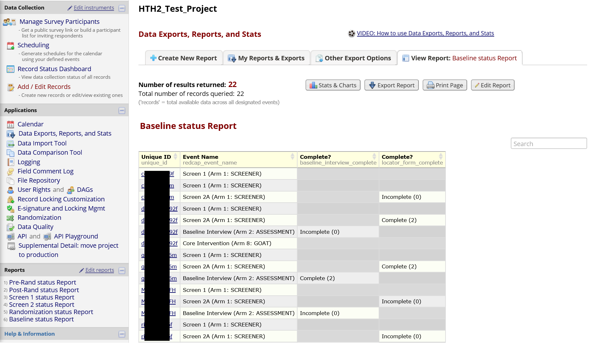
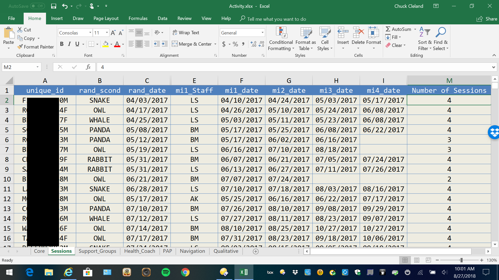

```{r setup, include=FALSE}
knitr::opts_chunk$set(echo=TRUE, comment=NA, message=FALSE, warning=FALSE, fig.align = 'center', fig.width = 12, fig.height = 10)
options(width=110)
```

# Overview of the Manual

The goal of this manual is to show how one might setup a [REDCap](https://projectredcap.org) project to support a research study with multiple conditions, such as factorial experiments common in the Multiphase Optimization Strategy ([MOST](https://methodology.psu.edu/ra/most)) framework. This manual is not meant to replace extensive and excellent documentation of REDCap. We will point to specific [REDCap documentation](https://projectredcap.org/resources/videos/) where readers can find more details when appropriate.

The manual is organized into three parts: 1) identification of common MOST study elements which need to be implemented in REDCap; 2) an overview of the REDCap system; and 3) an example REDCap project to illustrate how one might use REDCap to manage research conducted in the MOST framework.  The example project is intentionally small, to focus on overall organization, but the ideas in the example can easily be extended to more study conditions, events, and data collection fields. 

# MOST Study Elements

It is helpful to start by thinking of different elements likely to be needed for MOST and other research studies. Major elements to consider include the following: 

1. unique identifiers for individual participants
2. assessments
3. participant locator information
4. randomization
5. intervention component activities

## Unique identifiers

MOST studies will typically have a longitudinal component with individual participants returning, in person and/or online, for multiple activities. Consideration should be given to how individuals will be recognized over time.  

### Possible elements of a unique identifier:

1. First two letters of individual's LAST name
2. First letter of individual's FIRST name
3. First letter of mother's FIRST name
4. Month of birth, two digits
5. Day of birth, two digits
6. Last two digits of year of birth
7. Gender at birth (M or F)

An example: **CLCJ060769M**

Projects can create a process for collecting the unique identifier that includes a check on the length (exact number of characters) and, if this is the participant's very first study visit, a check that the unique identifier does not already exist in the project.

The unique identifier will be used to recognize and individual participant over time and keep all data related to that participant together through data management steps, so it is critical that it be collected and entered accurately whenever it is needed.  Project staff should be trained on the process for collecting and working with the unique identifier, and it may be useful to inform participants that the elements of the identifier need to be reported consistently over time. 

## Assessments

MOST studies will typically have at least four kinds of assessments of individual participants:

1. screening for eligibility
2. locator information to facilitate contact with individuals over time
3. baseline interview
4. one or more follow-up interviews

It is important to keep in mind that some individuals who are screened will not be eligible, and therefore will not continue into the main study. There also may be a lag of uncertain length between the start of screening for a potential participant and enrollment of that participant if eligible.  For REDCap setup, the implication is that screening should be a separate piece of the study.  This allows the timing of follow-up interviews and intervention activities to depend on the date of enrollment/baseline rather than the date on which screening started.

## Locator information with ongoing updates

A number of REDCap fields will be devoted to information to facilitate contacting individual participants over time for study activities. These may include:

1. cell phone number
2. email address
3. mailing address
4. names and contact information for family members, friends, or service programs likely to know where/how to find an individual participant

These fields may be entered and updated by project staff rather than participants directly. REDCap allows different users (i.e., staff on the project) to have or not have the rights to do different things within the system, and locator may be one part of the project where access is limited to specific staff.

Locator information can be updated when an individual participant is present for an assessment or intervention activity, so think about how updates to locator fields will be integrated into a regular project workflow.

## Intervention component activities

Think of fields needed within REDCap to document aspects of intervention component delivery. Components may be sessions with individual participants, group activities, or technology (e.g., text messages). At a minimum, the date, staff, duration, and completion status of an activity should be captured. Other fields related to intervention activities may include ratings of fidelity, measures of engagement/satisfaction, and descriptions of content discussed.   

## Condition-specific activities and data collection

The typical MOST study will have at least four different conditions and may have many more conditions. Some study activities and data collection will be condition-specific (only relevant for some of the study conditions). As will be described below, REDCap has a way to define events and related data collection that are specific to subsets of study participants.  

## Need to monitor and drive completion of common and condition-specific study activities

REDCap divides the whole study into **arms**, which are groups of events which may be common to all participants or specific to a subset of participants.  

To be more concrete, a participant in a condition which is assigned to the active level of a component gets events specific to that component (e.g., an intervention session).  Other events, such as a baseline interview, will be common to many more participants.  Some events may be univeral, such as a screening interview to determine eligibility for the study.  Event scheduling and data collection within the REDCap system is on an as needed basis.   

## Keeping track of intervention components and study conditions

As you prepare to set up REDCap to manage a study, it can be useful to create a table showing the study conditions and which level of each component they receive. Giving the study conditions names, rather than referring to them only with numbers or letters, can make it easier for staff to think about and discuss to activities needed for specific conditions. Consider a 2 x 2 x 2 full factorial design. A table to guide REDCap setup may look something like this:

| Condition | Name    | Video       | Text Messages | Support Groups |
|:---------:|:-------:|:-----------:|:-------------:|:--------------:|
| 1         | tuna    | 20 minutes  | Yes           |  Yes           |
| 2         | salmon  | 20 minutes  | Yes           |  No            |
| 3         | marlin  | 20 minutes  | No            |  Yes           |
| 4         | bass    | 20 minutes  | No            |  No            |  
| 5         | trout   | 3 minutes   | Yes           |  Yes           |  
| 6         | shark   | 3 minutes   | Yes           |  No            |  
| 7         | carp    | 3 minutes   | No            |  Yes           |  
| 8         | halibut | 3 minutes   | No            |  No            |  

In this example, study conditions are given fish names. With more than 16 conditions, names may not be helpful/feasible.  Each study condition will have a unique set of planned activities, which REDCap calls **events**.  Part of setting up a REDCap project for the study will involve mapping out all of the events each condition will experience, and at each of these events, one or more instruments may be designated for data collection.  

# Overview of REDCap 

Before you begin the setup of a MOST study, familiarize yourself with the REDCap system. Good starting points are the [brief](https://flash.its.vanderbilt.edu/html5/redcap/streams/_definst_/redcap_overview_brief02.mp4) and [detailed](https://flash.its.vanderbilt.edu/html5/redcap/streams/_definst_/redcap_overview03.mp4) overview videos.


## Types of REDCap projects

  REDCap offers a variety of project types.
  


If your interest is using REDCap to manage the complex set of activities in a typical MOST study (multiple conditions, condition-specific and common activities), you almost certainly want the **Longitudinal+Scheduling** project type. 

## Ways to build a REDCap project

In addition to the various **whole project settings** within REDCap, there are two ways to build the data collection fields of a REDCap project: the online designer and the data dictionary.

### Online Designer
  
The [online designer](blob:https://redcap.vanderbilt.edu/3225ff5c-bc41-47d4-b42b-c2ee71ef98d8) is an intuitive, point-and-click interface which allows users to build data collection fields.  Online designer also allows users to select instruments from the REDCap Shared Library, a repository of instruments which can be selected and inserted into your own project.  If an instrument the project needs exists within the library, this can save time and reduce errors.
  

  
This is what the interface to add a new field within online designer looks like:
  

  
### Data Dictionary
  
The [data dictionary](blob:https://redcap.vanderbilt.edu/e5d81f52-274c-4713-ad71-e5f6aaec1e3f) is a comma-delimited file with a very specific structure that can be used to specify fields in REDCap. An advantage of working directly in the data dictionary is that similar items can be setup more quickly by copying and pasting aspects of fields that are shared across the items.  Many of the cells in the data dictionary may be blank/unused.
  

  
Here is a brief description of the content specified in each of the **18** columns of the data dictionary:
  
| Column                                         | Description                                                                                    |
|:-----------------------------------------------|:-----------------------------------------------------------------------------------------------|
|  1. Variable / Field Name                      | A short name for the field which will become a variable name in exported data                  |
|  2. Form Name	                                 | Identifies a group of fields that go together; for example, locator form groups locator fields |
|  3. Section Header	                           | Provides a way to include headers and instructions between data collection elements            |
|  4. Field Type	                               | Common types include text, descriptive, radio, checkbox, file, and notes                       |
|  5. Field Label	                               | More detailed text associated with the field; for example, the content of an interview item    |
|  6. Choices, Calculations, OR Slider Labels	   | Response options or a calculation based on fields collected earlier                            |
|  7. Field Note	                               | A way to add instructions or other content to the field; for example, "minutes" for a duration |
|  8. Text Validation Type OR Show Slider Number | Specifies the kind/format of data expected; for exampe, date_mdy for a date field            	|
|  9. Text Validation Min	                       | Minimum allowed value for a field with validation                                              |
| 10. Text Validation Max	                       | Maximum allowed value for a field with validation                                              |
| 11. Identifier?	                               | Flags fields with identifying information (e.g., name) to facilitate deindentified exports     |
| 12. Branching Logic (Show field only if...)	   | A way to specify who should complete the field, based on data collected in other fields        |
| 13. Required Field?	                           | Does the field have to be completed before continuing?                                         |
| 14. Custom Alignment	                         | A way to control the alignment of the content shown when the field is completed	              |
| 15. Question Number (surveys only)	           | Auto-numbering is available, but custom item numbering for surveys can be specified here     	|
| 16. Matrix Group Name	                         | A way of grouping fields together into a matrix; fields with the same matrix name go together  |
| 17. Matrix Ranking?	                           | Used to rank choices in a matrix group; implies no two fields can have the same value          |
| 18. Field Annotation                           | Not displayed; can be used to set defaults, hide fields, and for other purposes                |
  
Both the online designer and the data dictionary allow customization of formatting, as both understand HTML code.  The example MOST project illustrates some of these possibilities below.

## Interview Items and Other Data Collection Fields
### Item types  

REDCap offers a wide variety of survey and interview item types.

* Text box (short text, number, date/time, etc)
* Notes box (paragraph text)
* Calculated field (derived from other fields)
* Multiple choice (drop-down list OR radio buttons)
* Checkboxes (check all that apply)
* Yes/No
* True/False
* Signature (with mouse, finger, or other device)
* Slider/Visual Analog
* File upload
* Descriptive text


### Branching logic

Branching logic is the way REDCap refers to interview skip patterns.  These are employed when fields need to be hidden during certain circumstances.  For instance, you may want to hide the question “How many hours per week do you watch TV?” until a “Yes” answer is checked for the previous question, “Do you watch TV?”.  

### Piping

Piping refers to inserting the response from an earlier data collection element into the content of a later data collection element.  Collected data can be piped not just to the field label of a subsequent field, but to any of the following places:

* Field Label
* Field Note
* Section Header
* Matrix field column headers
* Option labels for multiple choice fields (radio, drop-down, checkbox)
* Slider field labels (i.e. text displayed above slider bar)
* Custom record locking text (if defined, displayed at bottom of form)
* Survey Instructions
* Survey Completion Text
* Survey invitation emails (sent via Participant List or Automated Invitations) - includes both subject and message
* Custom text displayed at top of Survey Queue
* Inside the URL for a survey's 'Redirect to a URL' setting

All you need to do to pipe a data value into any of these valid places is insert into your text the variable name inside square brackets.

### Calculated fields

Calculations should be considered a tool not data.  Calculations should be reapplied during data analysis.  Do not reference calculated fields within calculated fields.  When multiple calculations are performed on the same data entry form, the order of execution is determined by the alphabetical order of the associated field names.

**Problem**:  Here, Calculation 2 will occur before Calculation 1!   
Calculation 1 [weight_met]=[weight]*.45359237    
Calculation 2 [BMI]=[weight_met]/([height]^2)  

To avoid this problem, calculate BMI in one step.

### Data validation  

Data validation provides ways to ensure collected data is entered in an expected format or falls within an expected range.  For example, a field collecting participant age in years could specify that only whole numbers from 0 to 150 are allowed.  When a response outside of the allowed range is given, REDCap will prompt the survey respondent or staff entering data to revise the entry. 

## Forms vs. Surveys for Data Collection

Two ways of collecting/entering data in REDCap are Forms and Surveys.  Forms are for data entered by project staff, not directly by participants.  Forms might be used to enter the results of biological testing or responses to items in a staff-administered personal interview.  Surveys are for data entered directly by participants.  Surveys may take place at a study field site, as an audio computer-assisted self-interview, or participants could be invited by email (or in other ways) to complete a survey in a location of their choice and with some flexibility around exactly when it happens (e.g., a participant could take a survey by following a link on their home computer at 9:45pm on a Sunday).

## Events

The entry point for setting up events within REDCap is the **Project Setup** tab.  This is where one can define study events and designate instruments used for each event.
  

  
Each **arm** in the project is a collection of events in a sequence.  For study conditions which receive multiple components, REDCap setup is an opportunity to consider the order in which those components will be delivered to participants, and whether temporal overlap among components is permissible or not.  REDCap setup is a good time to consider how intervention component activities and assessment activities are temporally organized.     

### Record-specific events
### Days-offset
### Specifies the “ideal” time for an activity as well as a range during which the activity can be completed Defining Longitudinal Events (5 min)
### Each event can have one or more instruments Designating Instruments for Events (3 min)
### Events and instruments can be repeated in a longitudinal project Repeating Instruments and Events (33 min)

## Organization of study activities into “Arms”
### Arms are a way to pull together a collection of events
### Screening
### Baseline interview
### Randomization
### Each MOST study condition may have an arm devoted to it to facilitate events and data collection that are specific to the condition
### Follow-up interviews

## Calendar application and scheduling
### Schedule for individuals in one place
### Based on series of events which apply to a specific record (individual participant), the calendar is populated with record-specific events
### The ideal time for an event can be changed to a time more convenient for the project and participant
### Calendar can be used to see what events are scheduled and to enter a data collection form associated with the scheduled event (e.g., if the scheduled event is a baseline interview, following the calendar link will open the baseline interview data collection forms).   

## Repeating Events and Instruments

>REDCap has the ability to repeat a data collection instrument or an entire event of instruments an unlimited number of times without having to specify the amount needed. This is sometimes called one-to-many data collection, in which a project can have one or more repeating parts. For example, if each record in a hypothetical project represents a person, then one might have a repeating instrument for medications, one for family members, one or adverse events, and one for collecting data over multiple visits (or weekly surveys), so that each repeating element is connected to the overall record but can repeat independently of the other instruments. So if using repeating instruments or repeating events, each record in the project can have a different number of repeated instances of any given instrument or event. One record may have five medications, but another may have two or none, for example. Such flexibility makes this feature very powerful, and setting up repeating instruments and/or repeating events in a project is very quick and easy. The repeating instruments/events feature can be enabled and set up by clicking the Enable button in the Optional Modules section on the Project Setup page.

### Repeating Instruments (for classic and longitudinal projects)

>Classic projects (i.e., in which the longitudinal module is not enabled) can utilize repeating instruments as a very simple way of doing longitudinal data collection. When traditionally using the longitudinal module in a project, one downside is that one must specify all the events (i.e., the repetitions of instruments) ahead of time, making sure to build out the maximum number of events that one might need, even though all of them likely won't be used by all records. However, with the repeating instruments functionality, one does not need to specify how many repetitions will needed ahead of time; one can simply repeat an instrument an unlimited amount of times. It is important to note that multiple instruments in a project can be enabled as repeating instruments (even all of them, if one wishes). Projects utilizing the longitudinal module can have repeating instruments as well, in which one or more instruments on any defined event can be set to repeat within that event. The repeating instruments functionality behaves very much the same way in both classic and longitudinal projects.

### Repeating Events (for longitudinal projects only)

>If a project has the longitudinal module enabled, it can utilize the repeating events feature, which works somewhat differently than the repeating instruments feature. While the repeating instruments feature allows one to repeat a given instrument as a single unit, the repeating events feature allows one to repeat an entire event of instruments together in unison. This might be useful if one has several instruments whose data correlates together, such as completing multiple surveys back to back for a specific time-point or visit, for example. Previously, one may have had to create X number of identical events to capture repeating data for the instruments on those events (e.g., Week 1, Week 2, ...), but the repeating events feature makes this much simpler by allowing one to create only one single event that can be repeated in unlimited fashion.

### Enabling Surveys for Repeating Instruments

>If one wishes to allow survey respondents to enter their responses in a repeating fashion in survey mode alone, one must enable an optional setting near the bottom of the Survey Settings page (in the survey termination options section) *after* an instrument has been set as a repeating instrument. So it is one additional step to do after enabling the instrument itself as a repeating instrument. When the repeat survey setting is enabled, it will display a button at the end of the survey so that the respondent can choose to enter another response for the survey, thus essentially allowing them to take the survey multiple times in a row. In this way, they will be able to enter as many responses for that same survey as they need. For example, if a REDCap project is aimed at mothers, and the repeating survey is for collecting data about each of the mother's children, the mother could complete the survey once for each child, thus allowing mothers with one child or six children to easily enter their data in a quick back-to-back fashion by repeating the survey. 

### Reports and Data Exports with Repeating Instruments and Events

>If one creates a report that contains data from a repeating instrument or repeating event, a field named 'redcap_repeat_instance' will be included that represents the instance number, which is an auto-numbered value (starting with '1') that gets incremented each time the instrument/event is repeated. And if the report contains data specifically from a repeating instrument (as opposed to a repeating event), then a field named 'redcap_repeat_instrument' will additionally be included that represents the instrument name that denotes to which instrument the row of data belongs. These two fields will only be included automatically in the report or data export if data originates from a repeating instrument or event. Note: Each repeated instance of an instrument or event will be displayed as a new row in the report or export file. This means that if a medications survey is repeated three times for one record, for example, it will be displayed as three rows in the report.


## Randomization Module
```{r}
library(tidyverse)
DF <- expand.grid(Person = 1:800, gender = 1:2)
DF <- DF %>% mutate(Block = cut(Person, 100))
set.seed(732212)
DF <- DF %>% group_by(gender, Block) %>% mutate(scond = sample(1:8)) %>% ungroup()
write.table(DF %>% select(scond, gender), file = "atab.csv", row.names = FALSE, sep = ",")
```

The randomization module sets up REDCap to randomly assign participants to specific study groups.  
Setup includes the following steps:  
1. Define your randomization model  
2. Download template allocation tables (as Excel/CSV files)  
3. Upload your allocation table (CSV file)  

Randomization can be stratified by one or more variables collected before the randomization step.  User rights functionality can control which project staff are allowed to randomize.  After the value of the random group is assigned, the random group field becomes read-only and the value can not be changed (by design!).

The table of allocations used by REDCap is generated outside of REDCap and saved in comma-delimited format.  The comma-delimited allocation table is uploaded to REDCap as the third and final step in setting up the randomization module.  In the example shown in the figure below, participants are assigned to one of eight study conditions and random assignment is stratified by gender.


## Reports

Reports can show data fields to understand collected data and facilitate project management.  
There are four steps to building a report:  
1. Select users who can access the report  
2. Select data fields to include in the report  
3. Select cases to include using logic applied to data fields (e.g., only show female participants)  
4. Select data fields used to order the results (e.g., sort report by age)  



## Record Status Dashboard

The Record Status Dashboard allows project staff to see which data entry forms have been completed for different individual participants.


## Data Export

### Pulling REDCap data by API

REDCap project data can be exported using an "Application Programming Interface" (API), which is just a way to request the export within a program rather than manually pointing and clicking.  Thus, API makes the process of regularly exporting data for summaries and project management smoother and more efficient. 

### Data from smaller projects can be exported manually within REDCap too

REDCap can export to the following formats: comma-delimited; SPSS; SAS; R; Stata; and XML.  The export interface can be accessed from the Project Home tab of your REDCap project.


  
## Things more easily done outside of REDCap

It is very likely you will want and need to do things with the collected data that are impossible or difficult to do within the REDCap system. A fairly efficient approach is to regularly export data from REDCap, and then generate the summaries and files needed to facilitate project management. The ability to use an application programming interface (API) to pull data from REDCap in a program greatly improves the efficiency of this workflow. I have used a combination of tools including various [R](https://www.r-project.org) packages and [GitHub](https://github.com/) to support the Heart-to-Heart 2 MOST study. The [redcapAPI R package](https://cran.r-project.org/web/packages/redcapAPI/index.html) uses the REDCap API to pull current project data, then there are many data management, summarizing, and list making steps in [R](https://www.r-project.org), and web pages generated in [R](https://www.r-project.org) are hosted on [GitHub](https://github.com/). GitHub and similar tools have options for both public and private repositories.  In addition to the web pages, it can be useful to generate MS-Excel files which list individual participants and highlight completed and needed study activities.  The [openxlsx R package](https://cran.r-project.org/web/packages/openxlsx/index.html) can be used to write MS-Excel files from R. 

### Review intervention activity gaps

Generating a simple list of participants with intervention activity due and completion dates can be useful for managing and driving completion of intervention activities.



### Review follow-up interviewing gaps

Generating a simple list of participants with interview target, earliest, and due dates, as well as days remaining and interview completion can be useful for managing and driving completion of interviews.


## REDCap Development and Production Modes  
REDCap has a **development** and a **production** mode. The development mode allows one to incrementally build and test project components.  The production mode is meant for real data collection and project management.  It is possible to make some changes after moving the project from the development to the production mode, but once in production changes should be made with extreme care.  

## REDCap is actively developed
Researchers using REDCap to manage MOST and other types of studies need to be aware of new features and system changes which may impact aspects of your project.  These changes are generally enhancements (new features) which don't have to be adopted in the middle of a project.  New REDCap features may require changes to this manual over time.


# A MOST REDCap project providing an example

The example illustrates the steps to set up a REDCap project for 2 x 2 x 2 full factorial design.  Therefore, the example study has **8** conditions.  Arms will be created to organize events related to the following study parts:

1. screening for eligibility
2. assessments common to all participants, including locator, a baseline interview, randomization, and a follow-up interview 
3. condition-specific events which utilize schedules tailored to individual study conditions and collect data related to the intervention activities in each study condition

Following the table above

## Enter the New Projects Tab of REDCap to select a project name and type


## Longitudinal Project Setup Steps

1. Main Project Settings

* Use surveys in this project
* Use longitudinal data collection with defined events
* Turn on the **Scheduling module**
* Turn on the **Randomization module**

2. Create study arms with **Define My Events**

* Screening
* Assessment
* tuna
* salmon
* marlin
* bass
* trout
* shark
* carp
* halibut

Why did we not having the screening steps as part of the Assessment arm?

The first event in the screening arm, a brief eligibility interview, is common to all potential study participants. There could be additional events in the screening arm for things like results of biological tests and documentation of a status related to eligibility criteria (e.g., ).  The goal of the screening arm is to assess various aspects of eligibility criteria, documenting who is eligible and, if not eligible, the reasons why.  Only potential participants who are eligible proceed to the main study.  Informed consent may be obtained from eligible individuals near the end of the screening arm.

The first event in the assessment arm is a baseline interview.  Other events in the assessment arm include one or more follow-up interviews and randomization.  The randomization event in the assessment arm is a manual recording of the assigned study condition by staff.  This can be checked against the condition assigned by the randomization module, with corrections made if needed.

Each randomly assigned study condition will have a different mix of events, depending on which level of each intervention component is required in the condition.  In a full factorial design, one condition may have few or no events related to intervention activities (e.g., a condition in which all components are assigned at an "off" or "absent" level).  Another condition in which multiple components are assigned at an "on" or "present" level will have all of the events associated with each active component. 

3. Define study events

4. Define ideal dates/times for events to take place

5. Designate data collection instruments to be administered at each study event

1. Go to the Project Setup tab and locate “Main Project Settings”
2. Enable: “Use longitudinal data collection with defined events”?
3. Find “Enable optional modules and customizations”
4. Select “Scheduling Module (longitudinal only)

## Screening and baseline interviews
## Locator
## Randomization to conditions
### Stratification factor
### Full factorial with two components, each with three levels (i.e., 8 study conditions)

## Fields related to intervention activities
* Activity
* Date
* Duration
* Staff

## First follow-up interview
## Second and final follow-up interview

# Supplemental File: An Example REDCap Project for a MOST Study

You can download the example REDCap project (XML) [here](https://clelandcm.github.io/REDCap-MOST/Manual.XML).

# Concluding Thoughts

* Nearly every piece of REDCap has a training video embedded inside the application
* Do not be afraid to create a project and explore away in development mode
* Contact **Chuck Cleland** (cmc13@nyu.edu) with any comments or suggestions for improving this manual

Blumenberg, C., & Barros, A. J. (2016). Electronic data collection in epidemiological research. The use of REDCap in the Pelotas birth cohorts. _Applied clinical informatics_, 7(3), 672-681.

Harris, P. A., Taylor, R., Thielke, R., Payne, J., Gonzalez, N., & Conde, J. G. (2009). Research electronic data capture (REDCap)--a metadata-driven methodology and workflow process for providing translational research informatics support. _Journal of biomedical informatics_, 42(2), 377-381.

Tomko, R. L., Gray, K. M., Oppenheimer, S. R., Wahlquist, A. E., & McClure, E. A. (2018). Using REDCap for ambulatory assessment: Implementation in a clinical trial for smoking cessation to augment in-person data collection. _The American journal of drug and alcohol abuse_, 1-16.

         
